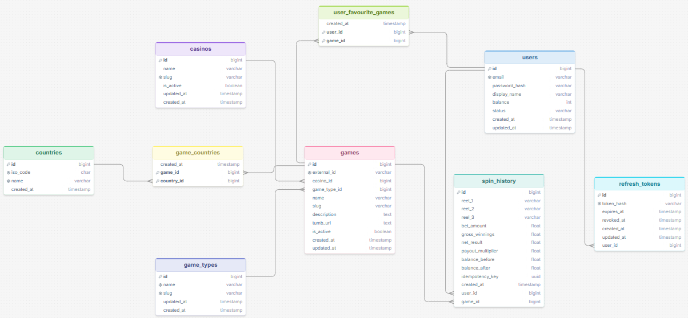
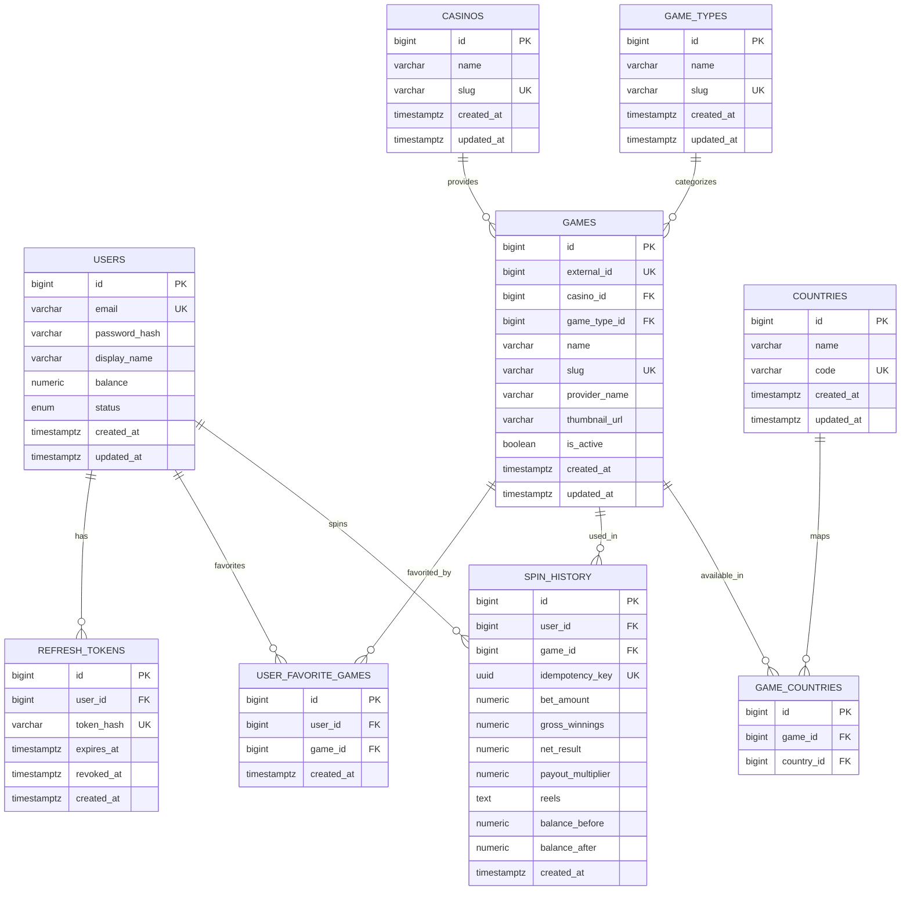

# Database Design

This document describes the database structure used by the Casino Platform.

The database is designed around users, games, casinos, game types, countries, favorites, spin history, and refresh tokens.

The main goal is to support:

* user authentication
* game listing and search
* user favorite games
* slot machine spins
* balance updates
* spin history
* refresh token rotation
* game metadata relationships

---

## Entity Relationship Diagram

The diagram below shows the main database relationships visually.





---

## Table Overview

### users

Stores registered users.

Important fields:

* `email`: unique login identifier
* `password_hash`: hashed password
* `display_name`: user-facing display name
* `balance`: current casino balance
* `status`: user status, such as `active` or `disabled`

---

### refresh_tokens

Stores hashed refresh tokens.

Refresh tokens are not stored as plain text. The API stores a hash of the token and uses it for token rotation and logout.

Important fields:

* `user_id`: owner of the refresh token
* `token_hash`: hashed refresh token
* `expires_at`: token expiration date
* `revoked_at`: set when the token is revoked or rotated

---

### casinos

Stores casino/provider group data.

A casino can have many games.

---

### game_types

Stores game categories such as slots, table games, or other categories.

A game belongs to one game type.

---

### games

Stores game metadata.

The application imports games from `game-data.json`.

Important fields:

* `external_id`: original id from the JSON data source
* `casino_id`: related casino
* `game_type_id`: related game type
* `name`: game title
* `slug`: URL-friendly unique identifier
* `provider_name`: provider name used for filtering/search
* `thumbnail_url`: game thumbnail image
* `is_active`: controls whether the game is available

---

### countries

Stores countries where games can be available.

---

### game_countries

Join table between `games` and `countries`.

This supports many-to-many availability rules.

---

### user_favorite_games

Join table between `users` and `games`.

This supports favorite/unfavorite functionality.

A user can favorite a game only once.

---

### spin_history

Stores every slot machine spin.

Important fields:

* `user_id`: user who performed the spin
* `game_id`: game that was played
* `idempotency_key`: prevents duplicate spin processing
* `bet_amount`: amount spent on the spin
* `gross_winnings`: total winnings from the spin
* `net_result`: balance impact after subtracting the bet
* `payout_multiplier`: multiplier applied by the slot result
* `reels`: resulting symbols
* `balance_before`: user balance before the spin
* `balance_after`: user balance after the spin

---

## Relationships

### User relationships

```txt
users 1 -> many refresh_tokens
users 1 -> many user_favorite_games
users 1 -> many spin_history
```

### Game relationships

```txt
games many -> 1 casinos
games many -> 1 game_types
games 1 -> many user_favorite_games
games 1 -> many spin_history
games 1 -> many game_countries
```

### Country relationships

```txt
countries 1 -> many game_countries
game_countries many -> 1 games
game_countries many -> 1 countries
```

---

## SQL Create Statements

The actual database schema is created through TypeORM migrations.
The SQL below documents the intended schema shape.

```sql
CREATE TYPE users_status_enum AS ENUM ('active', 'disabled');

CREATE TABLE users (
  id BIGSERIAL PRIMARY KEY,
  email VARCHAR(255) NOT NULL UNIQUE,
  password_hash VARCHAR(255) NOT NULL,
  display_name VARCHAR(100) NOT NULL,
  balance NUMERIC(12, 2) NOT NULL DEFAULT 20.00,
  status users_status_enum NOT NULL DEFAULT 'active',
  created_at TIMESTAMPTZ NOT NULL DEFAULT now(),
  updated_at TIMESTAMPTZ NOT NULL DEFAULT now()
);

CREATE TABLE casinos (
  id BIGSERIAL PRIMARY KEY,
  name VARCHAR(255) NOT NULL,
  slug VARCHAR(255) NOT NULL UNIQUE,
  created_at TIMESTAMPTZ NOT NULL DEFAULT now(),
  updated_at TIMESTAMPTZ NOT NULL DEFAULT now()
);

CREATE TABLE game_types (
  id BIGSERIAL PRIMARY KEY,
  name VARCHAR(255) NOT NULL,
  slug VARCHAR(255) NOT NULL UNIQUE,
  created_at TIMESTAMPTZ NOT NULL DEFAULT now(),
  updated_at TIMESTAMPTZ NOT NULL DEFAULT now()
);

CREATE TABLE games (
  id BIGSERIAL PRIMARY KEY,
  external_id BIGINT UNIQUE,
  casino_id BIGINT NOT NULL,
  game_type_id BIGINT NOT NULL,
  name VARCHAR(255) NOT NULL,
  slug VARCHAR(255) NOT NULL UNIQUE,
  provider_name VARCHAR(255) NOT NULL,
  thumbnail_url TEXT,
  is_active BOOLEAN NOT NULL DEFAULT true,
  created_at TIMESTAMPTZ NOT NULL DEFAULT now(),
  updated_at TIMESTAMPTZ NOT NULL DEFAULT now(),

  CONSTRAINT fk_games_casino
    FOREIGN KEY (casino_id)
    REFERENCES casinos(id)
    ON DELETE RESTRICT,

  CONSTRAINT fk_games_game_type
    FOREIGN KEY (game_type_id)
    REFERENCES game_types(id)
    ON DELETE RESTRICT
);

CREATE TABLE countries (
  id BIGSERIAL PRIMARY KEY,
  name VARCHAR(255) NOT NULL,
  code VARCHAR(10) NOT NULL UNIQUE,
  created_at TIMESTAMPTZ NOT NULL DEFAULT now(),
  updated_at TIMESTAMPTZ NOT NULL DEFAULT now()
);

CREATE TABLE game_countries (
  id BIGSERIAL PRIMARY KEY,
  game_id BIGINT NOT NULL,
  country_id BIGINT NOT NULL,

  CONSTRAINT fk_game_countries_game
    FOREIGN KEY (game_id)
    REFERENCES games(id)
    ON DELETE CASCADE,

  CONSTRAINT fk_game_countries_country
    FOREIGN KEY (country_id)
    REFERENCES countries(id)
    ON DELETE CASCADE,

  CONSTRAINT uq_game_country
    UNIQUE (game_id, country_id)
);

CREATE TABLE user_favorite_games (
  id BIGSERIAL PRIMARY KEY,
  user_id BIGINT NOT NULL,
  game_id BIGINT NOT NULL,
  created_at TIMESTAMPTZ NOT NULL DEFAULT now(),

  CONSTRAINT fk_user_favorite_games_user
    FOREIGN KEY (user_id)
    REFERENCES users(id)
    ON DELETE CASCADE,

  CONSTRAINT fk_user_favorite_games_game
    FOREIGN KEY (game_id)
    REFERENCES games(id)
    ON DELETE CASCADE,

  CONSTRAINT uq_user_favorite_game
    UNIQUE (user_id, game_id)
);

CREATE TABLE spin_history (
  id BIGSERIAL PRIMARY KEY,
  user_id BIGINT NOT NULL,
  game_id BIGINT NOT NULL,
  idempotency_key UUID NOT NULL UNIQUE,
  bet_amount NUMERIC(12, 2) NOT NULL,
  gross_winnings NUMERIC(12, 2) NOT NULL DEFAULT 0.00,
  net_result NUMERIC(12, 2) NOT NULL DEFAULT 0.00,
  payout_multiplier NUMERIC(8, 2) NOT NULL DEFAULT 0.00,
  reels TEXT NOT NULL,
  balance_before NUMERIC(12, 2) NOT NULL,
  balance_after NUMERIC(12, 2) NOT NULL,
  created_at TIMESTAMPTZ NOT NULL DEFAULT now(),

  CONSTRAINT fk_spin_history_user
    FOREIGN KEY (user_id)
    REFERENCES users(id)
    ON DELETE CASCADE,

  CONSTRAINT fk_spin_history_game
    FOREIGN KEY (game_id)
    REFERENCES games(id)
    ON DELETE RESTRICT
);

CREATE TABLE refresh_tokens (
  id BIGSERIAL PRIMARY KEY,
  user_id BIGINT NOT NULL,
  token_hash VARCHAR(255) NOT NULL UNIQUE,
  expires_at TIMESTAMPTZ NOT NULL,
  revoked_at TIMESTAMPTZ,
  created_at TIMESTAMPTZ NOT NULL DEFAULT now(),

  CONSTRAINT fk_refresh_tokens_user
    FOREIGN KEY (user_id)
    REFERENCES users(id)
    ON DELETE CASCADE
);
```

---

## Indexing Notes

The schema uses unique constraints and indexes for lookup-heavy fields.

Recommended indexes:

```sql
CREATE INDEX idx_games_name ON games(name);
CREATE INDEX idx_games_provider_name ON games(provider_name);
CREATE INDEX idx_games_slug ON games(slug);
CREATE INDEX idx_games_external_id ON games(external_id);

CREATE INDEX idx_user_favorite_games_user_id ON user_favorite_games(user_id);
CREATE INDEX idx_user_favorite_games_game_id ON user_favorite_games(game_id);

CREATE INDEX idx_spin_history_user_id ON spin_history(user_id);
CREATE INDEX idx_spin_history_game_id ON spin_history(game_id);
CREATE INDEX idx_spin_history_created_at ON spin_history(created_at);

CREATE INDEX idx_refresh_tokens_user_id ON refresh_tokens(user_id);
CREATE INDEX idx_refresh_tokens_token_hash ON refresh_tokens(token_hash);
```

For better PostgreSQL search performance, trigram indexes could be considered in a production system.
For this technical test, simple `ILIKE` based search is sufficient and easier to review.

---

## Design Decisions

### Bigint primary keys

The main tables use bigint-style primary keys.

This keeps relationships simple and efficient while still allowing external data ids to be stored separately.

### External game id

The original game id from the JSON file is stored in `games.external_id`.

This avoids mixing internal database ids with external data source ids.

### Join tables

The schema uses join tables for many-to-many relations:

```txt
games <-> countries
users <-> favorite games
```

### Spin idempotency

The `spin_history.idempotency_key` field prevents duplicate spin processing.

This is useful if a frontend request is retried or accidentally submitted more than once.

### Refresh token hashing

Refresh tokens are stored as hashes instead of plain text.

This reduces the impact of a database leak.

---

## Migration Notes

The application uses TypeORM migrations as the source of truth for database creation.

Typical commands:

```bash
pnpm migration:run
pnpm migration:revert
```

A new migration should be generated only when entity definitions change.

```bash
pnpm migration:generate
```

After deleting the Docker database volume, migrations and seed data must be run again:

```bash
docker compose up -d
cd apps/api
pnpm migration:run
pnpm seed
```
